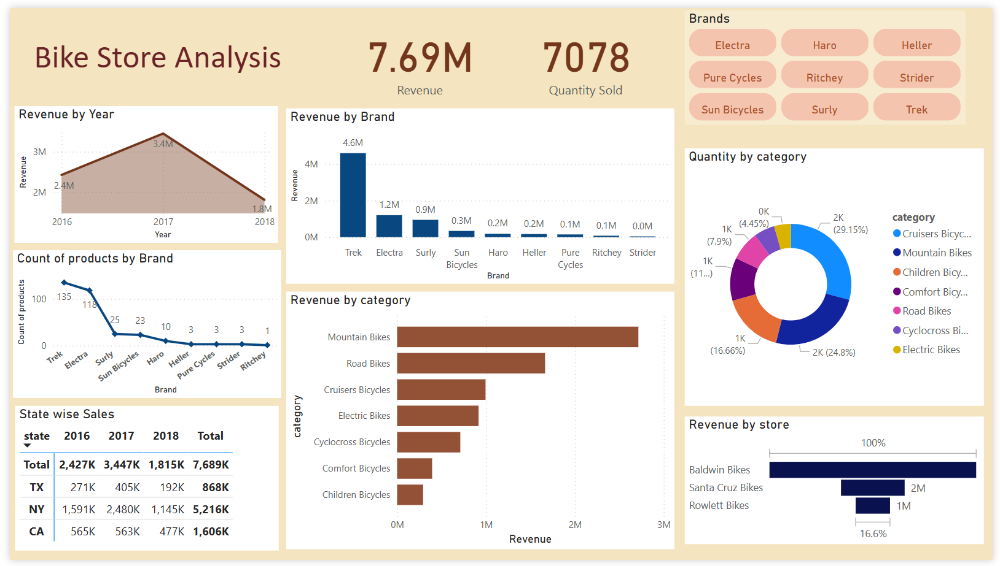

# Data Science & Data Analysis Portfolio

##  About

Hi, I'm Deep Shah. I have an academic background in Automobile Engineering and completed my MBA in General Management. I began my career in sales, which gave me a strong understanding of business operations. Over time, I transitioned into a data analyst role, where I have been working for the past year, applying analytical techniques to support business decisions.

I have a solid foundation in statistical analysis, data visualization, and ML modeling. I am skilled in Python, SQL, Tableau, Power BI, and Excel, with experience in cleaning, analyzing, and interpreting complex datasets to uncover meaningful insights. I have also completed a certification in Artificial Intelligence and Machine Learning to strengthen my technical foundation.

I’m passionate about using data analytics to solve real-world problems and optimize operational efficiency. I’m currently looking to grow further in the field of data analysis or data science, continuously learning and applying my skills to create business impact.

My CV in [pdf](./Deep%20Shah_Resume.pdf)

---

##  Portfolio Projects
This section highlights my data analytics projects, each briefly describing the problem solved and the technology stack used.

### Python
###  House Price Prediction

- **[House Price Prediction](./House_Price_Prediction.ipynb)**  
  This project focuses on predicting house prices using supervised machine learning techniques. The workflow includes data cleaning, exploratory data analysis (EDA), and applying multiple regression models to evaluate performance and accuracy.

  **Models Used:**
  - Linear Regression  
  - Support Vector Regression (SVR)  
  - Random Forest Regressor  
  - XGBoost Regressor  

  **Key Steps Involved:**
  - Handling missing values and encoding categorical features  
  - Conducting EDA to understand relationships and distributions  
  - Implementing cross-validation and hyperparameter tuning for model optimization  
  - Evaluating models using RMSE, MAE, and R² Score  
  - Visualizing feature importance to interpret model results (for tree-based models)  

  **Tools & Libraries:**  
  Python, Pandas, NumPy, Scikit-learn, XGBoost, Matplotlib, Seaborn

---

### SQL

 ###  Olympic Games Analysis – SQL Project
- **[Olympics Data Exploration](./Olympic_Analysis.sql)**  

This project involves analyzing Olympic Games data using structured SQL queries. The analysis covers various dimensions of the Olympics dataset such as participation, medal tallies, athlete performance, and country-wise success.

####  SQL Techniques used:
- Data aggregation and filtering
- Window functions (`RANK()`, `DENSE_RANK()`, `OVER()`)
- Common Table Expressions (CTEs)
- String concatenation and conditional logic
- Grouping and sorting for insightful breakdowns

> This analysis demonstrates the use of SQL for deriving insights from a sports dataset, useful for exploring historical trends, nation-wise performance, and medal distributions.

***
### Bike Store Sales Analysis – SQL Project

- **[Bike Store SQL Analysis](./Bike_Stores_Analysis.sql)**  

This project involves performing a detailed sales analysis for a bike store using structured SQL queries. It explores various business-critical metrics such as product performance, customer trends, sales distribution across stores and cities, and staff efficiency.

#### SQL Techniques Used

- Data aggregation with `SUM()`, `COUNT()`, `ROUND()`, and `CAST()`
- Ranking and window functions (`RANK() OVER`)
- Date/time extraction using `strftime()` for year-wise trends
- Conditional logic with `CASE WHEN`
- Joins across multiple related tables (customers, products, orders, stores, etc.)
- Subqueries and nested aggregations

> This analysis highlights how SQL can be effectively used to evaluate retail sales performance, understand customer behavior, monitor inventory flow, and identify high-performing regions, products, and staff.

---
### Power BI

### Bike Store Analysis

This Power BI dashboard analyze the performance of a fictional bike store business across multiple dimensions including revenue, quantity sold, product categories, brands, stores, and states.

 

## Dashboard Highlights

- Total Revenue (2016–2018)
- Revenue by category, brand, and store
- Quantity sold by product category and state
- Top brands: Trek, Electra, Surly
- Product count by brand
- Brand-wise filtering via slicer for detailed insights

[Download the interactive Power BI report (.pbix)](./Bike_Store_Analysis.pbix) for detailed exploration.
